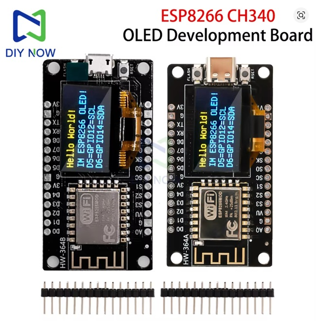

# ESP8266 OLED Project

**Warning:**
Recent Chinese ESP8266 boards, especially those with USB-C from AliExpress, have pins 12 and 14 swapped compared to older versions. **This code is for the new boards** with the reversed pinout. Please check your board before connecting the OLED display!

## Board Photo

Below is a photo of the typical ESP8266 USB-C development board from AliExpress. Make sure your board matches this type:

## Project Description
This project demonstrates using an ESP8266 with an OLED display. Make sure to connect the display according to the new pinout (see warning above).

## Usage
- Upload the code to your ESP8266 board.
- Connect the OLED display to the correct pins (see above).

## License
MIT License
